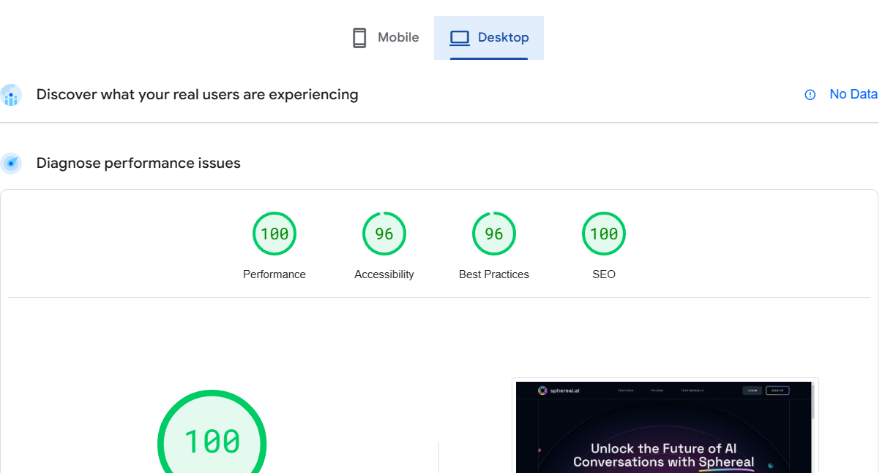

# JP-Tribe-AI-Landing

A modern AI landing page developed by **NighteCoding**. This project provides a visually appealing and responsive design using cutting-edge technologies to showcase AI UI and features.



---

## 🚀 Description

JP-Tribe-AI-Landing is a Next.js-based web application for showcasing AI tools and resources. It is built with a focus on performance, SEO, and responsiveness, making it ideal for presenting AI-related services and products.

---

## 🛠 Tech Stack

- **Next.js 14**: React framework for fast and modern web development.
- **TypeScript**: Strongly typed programming for better maintainability.
- **TailwindCSS**: Utility-first CSS framework for rapid UI development.
- **Framer Motion**: Library for animations and interactions.
- **App Directory**: Leveraging Next.js's latest app directory features.

---

## ⚙️ Setup Instructions

1. Clone the repository:
   ```bash
   git clone https://github.com/JannickPepe/Tribe-RoboAI-Landing.git
